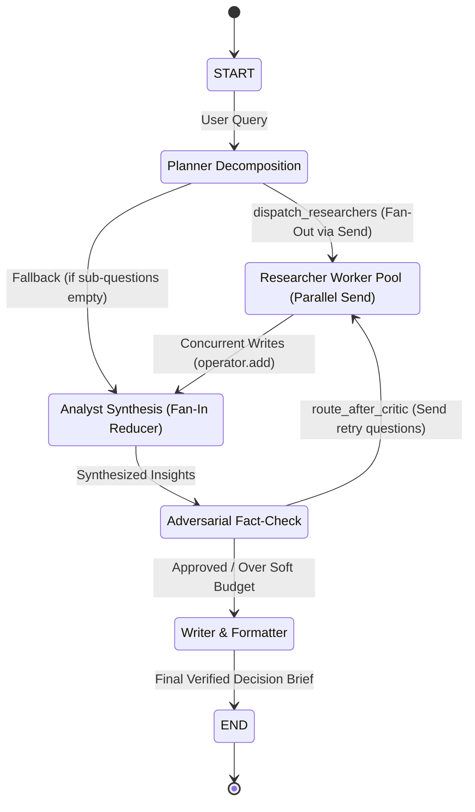
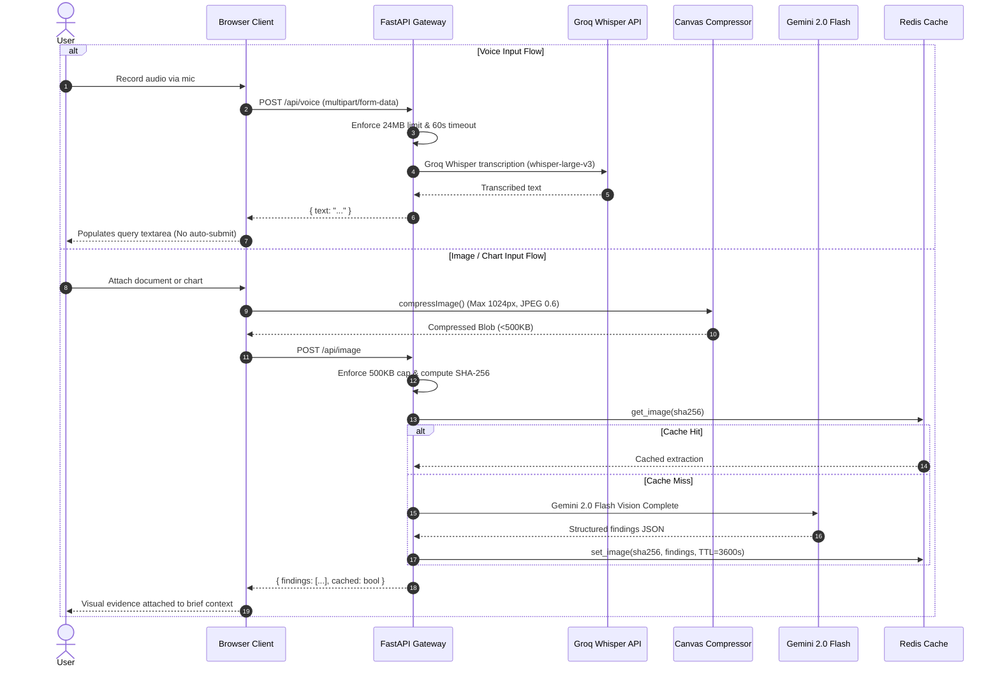
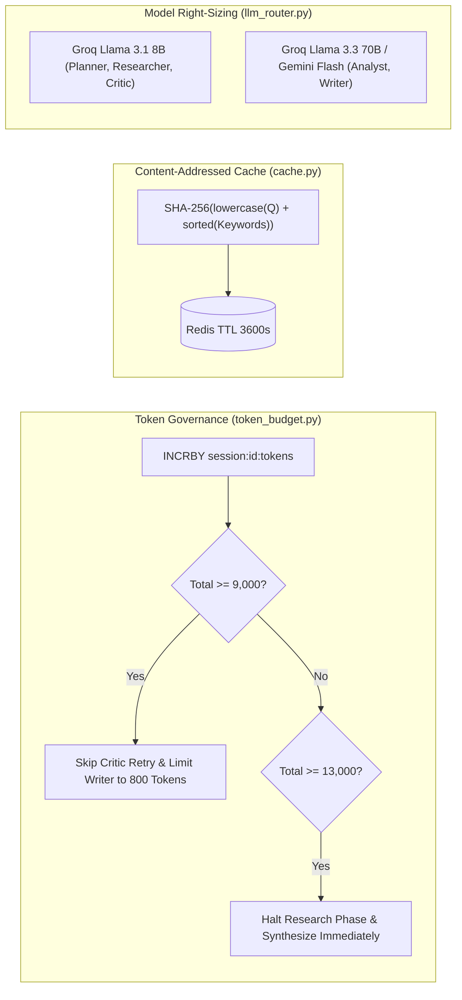

# ResearchSwarm System Architecture

ResearchSwarm is a source-grounded, multi-agent intelligence engine designed for high-stakes decision workflows. It replaces unverified single-prompt LLM outputs with an audited, deterministic 5-agent pipeline featuring parallel evidence harvesting, adversarial critique, strict token budget governance, and multi-format document generation.

---

## 1. High-Level Architecture Diagram

```mermaid
flowchart TD
    User([User / Browser])
    
    subgraph Frontend ["Frontend (React 18 + TypeScript + Vite)"]
        UI[Query Formulation UI]
        VoiceMod[VoiceInput (MediaRecorder)]
        ImgMod[ImageUpload (Canvas Compressor)]
        Dash[Live Orchestration Dashboard]
        Replay[Replay Mode & Export]
    end

    subgraph BackendGateway ["API Gateway & Security (FastAPI)"]
        Auth[JWT / API Key Auth & Rate Limiter]
        VoiceRoute[POST /api/voice]
        ImgRoute[POST /api/image]
        SessionRoute[POST /api/sessions]
        StatusRoute[GET /api/sessions/:id/status & tokens]
        WSRoute[WebSocket /ws/:id]
    end

    subgraph CoreEngine ["Coordination Engine & LangGraph StateGraph"]
        Graph[LangGraph StateGraph Engine]
        Budget[TokenBudgetTracker (9k/13k Limits)]
        Cache[ResearchCache (SHA-256 Content-Addressed)]
        Router[LLMRouter (Model Right-Sizing)]
    end

    subgraph Agents ["Specialized Agent Swarm"]
        Planner[1. Planner Agent]
        Researchers[2. Researcher Pool (Fan-Out)]
        Analyst[3. Analyst Agent (Fan-In Reducer)]
        Critic[4. Critic Agent (Adversarial Loop)]
        Writer[5. Writer Agent (Streaming Report)]
    end

    subgraph ExternalProviders ["External Services & Models"]
        GroqWhisper[Groq Whisper (whisper-large-v3)]
        GroqLLM[Groq Llama 3.1 8B & Llama 3.3 70B]
        Gemini[Google Gemini 2.0 Flash (Vision + Synthesis)]
        Tavily[Tavily Search API]
        DDG[DuckDuckGo Fallback Search]
        Redis[(Redis Key-Value & Pub/Sub)]
    end

    User --> UI
    UI --> VoiceMod
    UI --> ImgMod
    VoiceMod --> VoiceRoute --> GroqWhisper
    ImgMod --> ImgRoute --> Gemini
    UI --> SessionRoute --> Graph
    Graph --> Planner
    Planner -->|Send() Fan-Out| Researchers
    Researchers --> Router
    Router --> Tavily
    Tavily -.->|Fallback| DDG
    Router --> GroqLLM
    Researchers -->|Annotated Reducer| Analyst
    Analyst --> Router --> Gemini
    Analyst --> Critic
    Critic --> Router --> GroqLLM
    Critic -->|Conditional Edge| Writer
    Critic -.->|Retry Gap Re-Query| Researchers
    Writer --> Router --> Gemini
    Writer --> WSRoute --> Dash
    Graph <--> Redis
    Budget <--> Redis
    Cache <--> Redis
```

---

## 2. LangGraph StateGraph Topology

ResearchSwarm uses LangGraph's deterministic `StateGraph` with the `Send` API for parallel fan-out and `Annotated[List[dict], operator.add]` for concurrent fan-in writes.



### Key Graph Components
1. **`planner_node`**: Deconstructs complex research queries into 2–3 orthogonal sub-questions.
2. **`dispatch_researchers`**: Creates dynamic parallel branches using `Send("researcher_worker_node", {"current_sub_question": sq})`.
3. **`researcher_worker_node`**: Performs content-addressed cache lookup, queries Tavily (with DuckDuckGo fallback), caps sources, and formats structured findings.
4. **`analyst_node`**: Receives accumulated `research_findings` and `image_findings` via the fan-in reducer, detects contradictions, and builds confidence maps.
5. **`critic_node`**: Stresses the evidence, flags unsupported claims ($<0.60$), and requests targeted re-research if confidence $<0.50$.
6. **`route_after_critic`**: Enforces the 2-round retry ceiling and token budget limits before fanning out retry workers or advancing to the writer.
7. **`writer_node`**: Streams structured markdown executive briefs directly to WebSockets.

---

## 3. Multimodal Dual-Input Pipeline



---

## 4. Multi-Tier Caching & Token Budget Governance



---

## 5. Technology Stack Summary

| Layer | Technologies | Key Features |
| :--- | :--- | :--- |
| **Frontend** | React 18, TypeScript, Vite, TailwindCSS, Lucide Icons | Responsive glassmorphic UI, live token counters, MediaRecorder voice input, client-side canvas compression, Replay mode. |
| **Backend Framework** | Python 3.12+, FastAPI, Pydantic v2, uvicorn | Async route handlers, JWT authentication, rate limiting, multipart handling, SSE/WebSocket streaming. |
| **Orchestration** | LangGraph, LangChain Core | StateGraph, Send API dynamic fan-out, Annotated fan-in reducers, conditional retry loops, MemorySaver checkpointer. |
| **Persistence & State** | Redis 5+, redis-py async | Content-addressed caching, token budget counters, pub/sub WebSocket broadcast, session metadata. |
| **AI Models & Search** | Groq (Llama 3.1 8B, 3.3 70B, Whisper Large v3), Google Gemini 2.0 Flash, Tavily, DuckDuckGo | Model right-sizing, vision OCR, multimodal transcription, dual-provider resilient search. |
